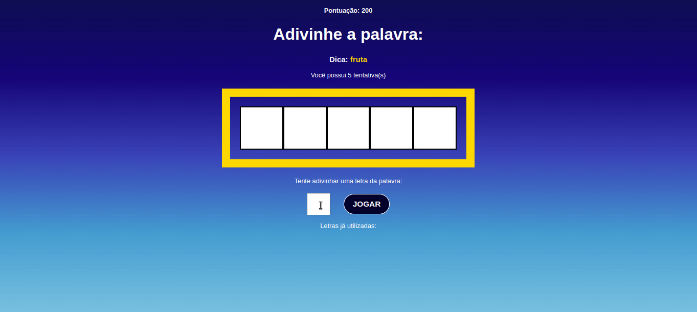

<h1>Projeto Palavra Secreta</h1>

Este projeto foi desenvolvido em React, durante o curso de React da plataforma Udemy, sob as instruções do <a href="https://www.udemy.com/user/matheus-battisti/?gclid=Cj0KCQiA8aOeBhCWARIsANRFrQG_L_muRLSl42Kds4DNZsmK04oMrGvLAdrpcBRHR8MovYXr_OKqnrcaAmZJEALw_wcB">Matheus Battisti</a>. O intuito deste game é descobrir as palavras secretas e pontuar, antes que acabem as chances.

    

#### Scripts

Para baixar as dependências do projeto:

#### `npm install`

Para rodar o projeto:

#### `npm start`

